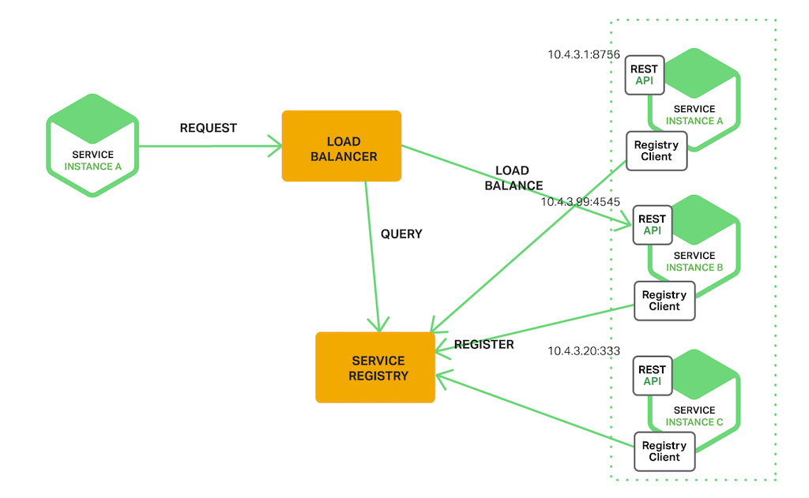
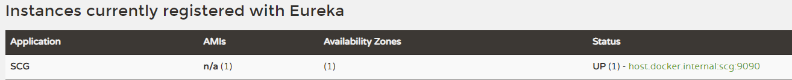

# Discover Pattern

- 클라이언트가 Load Balancer(Router)로 요청을 보내면 로드밸런서는 Service Registry에 서비스의 네트워크 주소를 Query해서 사용가능한 서비스로 요청을 전송한다.
- 위와같이 Client가 직접 질의하지 않는것이 Server Side Discovery Pattern이고 Client가 직접 Service Registry로 질의하여 요청을 보내는 것이 Client Side Discovery Pattern이라고 한다.
- Client Side Discovery Pattern은 클라이언트가 사용 가능한 서비스를 알고 있기 때문에 서비스별로 알맞은 로드 밸런싱 방법을 선택할 수 있지만 클라이언트와 Service registry간 의존성이 생긴다는 단점이 있다. 또한 클리이언트 쪽에서 Service를 찾는 로직을 구현해야한다.
- Server Side Discovery Pattern은 클라이언트 쪽에서 Service를 찾는 로직을 분리할 수 있지만 로드밸런서를 구축해야 하는 번거로움이 존재한다.

# Eureka
- Service Discovery의 구현체이다.

## Eureka Server
- Dependency를 추가하고,  SpringBootApplication에 @EnableEurekaServer 어노테이션을 추가하는 것으로 Eureka Server를 사용할 수 있다.
### dependency
```
implementation 'org.springframework.cloud:spring-cloud-starter-netflix-eureka-server'
```

### application.yml
```
eureka:
	server:
		enable-self-preservation: false
	instance:
		hostname: localhost
		prefer-ip-address: true
	client:
		register-with-eureka: false
		fetch-registry: false
		service-url:
			default-zone: http://localhost:8761/eureka/
```
- enable-self-preservation
  - Eureka에 등록된 client들은 주기적으로 heartbeat를 보내 연결이 유효함을 계속해서 갱신한다. 만약 heartbeat를 받지 못하면 Eureka는 해당 client를 registry에서 제거해 버린다.
  - 네트워크 문제가 발생해 heartbeat를 받지 못한다면 대량의 client를 registry에서 제거해버리는 상황이 올 수 있는데 이러한 상황을 위해 존재하는 옵션이다.
  - True일 때 Default설정은 15분 이내에 들어와야 할 갱신 요청이 기대값의 85%이하가 되면 요청이 없어도 registry에서 Client들을 제거하지 않고 보존한다.
- registerWithEureka
    - 자신을 eureka 서버에 등록할지 여부 (Server이면서 Client일 수 있음)
- fetchRegistry
    - Registry정보를 로컬에 캐싱할지에 대한 여부

## Eureka Client
### dependency
```
implementation 'org.springframework.cloud:spring-cloud-starter-netflix-eureka-client'
```
### application.yml
```
eureka:
	client:
		service-url:
			default-zone: http://localhost:8761/eureka
```
- dependency를 추가하고 eureka Server의 Url을 설정해 준 뒤 SpringBootApplication에 @EnableDiscoveryClient 어노테이션을 통해 Eureka Server에 Registry할 수 있다.

Server와 Client를 실행시키고 eureka Server(localhost:8761)로 접속해보면 아래 처럼 Client가 등록된 것을 확인할 수 있다.

