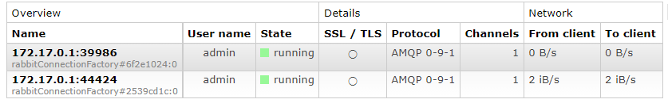
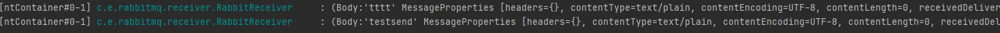

### RabbitMQ

- AMQP 프로토콜 기반 메시지 브로커
- Publisher(Sender)는 rabbitTemplate으로 RabbitMQ에게 Msg를 전송한다. 해당 Msg내부에는 어떤 Exchange로 가야하는지, 어떤 Queue로 가야하는지에 대한 정보가 포함되어 있다.
- RabbitMQ에서는 Exchange가 Msg를 받아 전송되어야 하는 Queue로 Routing해준다.
- 마지막으로 Queue에 쌓인 Msg를 Consumer(Receiver)가 RabbitMQ로 부터 전달 받거나 요청을 통해 Msg를 fetch or pull할 수 있다.
- Spring에서 RabbitMQ를 사용하기 위해서는 Spring AMQP 라이브러리를 사용하면 된다.

### rabbitmq server 실행
```
docker run -d --name rabbitmq -p 5672:5672 -p 15672:15672 --restart=unless-stopped -e RABBITMQ_DEFAULT_USER=admin -e RABBITMQ_DEFAULT_PASS=admin rabbitmq:management
```
- 5672 : rabbitMQ 기본 통신 Port
- 15672 : web 관리용 Port

### Exchange와 Queue Mapping
- RabbitMQ Manage를 통해 exchange, queue 생성하기
    - Exchanges 탭에서 Add exchange, Queues 탭에서 Add Queue를 통해 Exchange와 Queue를 생성할 수 있다.
        - Exchange에는 Type이 4가지 type이 존재한다.
            1. Direct : Routing Key가 정확히 일치하는 Queue에 메시지 전송 (Unicast)
            2. Topic : Routing Key 패턴이 일치하는 Queue에 메시지 전송 (Multicast)
            3. Fanout : Exchange에 등록된 모든 Queue에 메시지 전송 (Broadcast)
            4. Headers : Key:Value로 이루어진 header값을 기준으로 일치하는 Queue에 메시지 전송 (Multicast)
    - 이후 Exchanges탭에서 생성한 Exchange를 선택해 Queue와 바인딩 할 수 있다.
- Spring Configuration을 통해 생성하기
    - Exchange를 RabbitMQ Manage를 통해 생성하고 아래 코드 처럼 bind를 해주면 된다. 
    ```
    @Configuration
    public class RabbitConfig {

        private static final String EXCHANGE_NAME = "test";
        private static final String QUEUE_NAME = "testQueue";
        private static final String ROUTING_KEY = "testRoute";

        @Bean
        TopicExchange exchange() {
            return new TopicExchange(EXCHANGE_NAME);
        }

        @Bean
        Queue queue() {
            return new Queue(QUEUE_NAME);
        }

        @Bean
        Binding binding(Queue queue, TopicExchange topicExchange) {
            return BindingBuilder.bind(queue).to(topicExchange).with(ROUTING_KEY);
        }
    }
    ```    

### Publisher(Sender)

- rabbitTemplate의 convertAndSend를 사용해 메시지를 전송할 수 있다.
- convertAndSend는 Exchange Name, Routing Key, Msg 를 인자로 받는다.

### Consumer(Receiver)

- RabbitListener 어노테이션을 사용해 쉽게 설정 가능하다.


- receiver, sender를 실행시키면 RabbitMQ와 연결되는 것을 확인할 수 있다.
- sender의 Controller를 통해 메시지를 전송하면 아래처럼 receiver가 수신하는 것을 확인할 수 있다.
  


### Object 전송
- RabbitMQ의 Default Message Converter는 input으로 String을 받기 때문에 객체를 전송하기 위해서는 Object Mapper혹은 toString을 사용한 뒤 전송을 수행해야한다.
- RabbitMQ의 Message Converter를 Jackson2JsonMessageConverter로 변경하는 것으로 객체를 직접 변환해주지 않고 전송할 수 있다. (Jackson2JsonMessageConverter는 Object를 input으로 받음)
- rabbitTemplate의 MessageConverter 변경하기
  - configuration의 rabbittemplate Bean에서 setMessageConverter를 통해 변경할 수 있다.
    ```
    @Bean
    public RabbitTemplate rabbitTemplate(ConnectionFactory connectionFactory) {
        RabbitTemplate rabbitTemplate = new RabbitTemplate(connectionFactory);
        rabbitTemplate.setConverter(new Jackson2JsonMessageConverter);
        return rabbitTemplate;
    }
    ```
- consumer는 Message Header의 TypeId를 통해 메시지를 deserialize한다. TypeId는 serialize한 Object의 package 및 class명이 작성되어 있다. 따라서 publisher와 consumer사이에 변환할 Object의 위치가 다르면 에러가 발생한다.